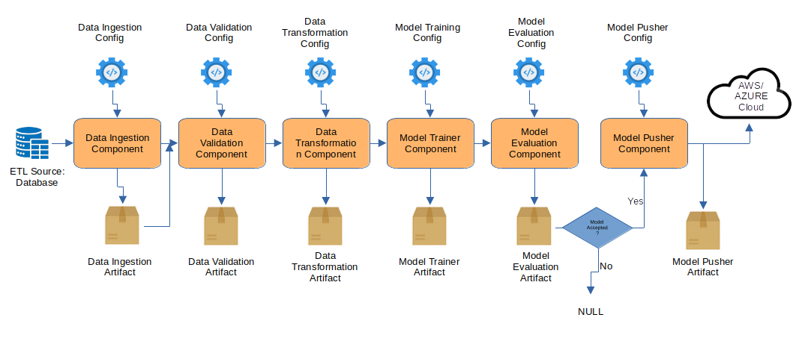

# Nano-AutoML-Cloud: An End-to-End, Cloud-Based, Production-Ready Machine Learning Pipeline
**Nano AutoML Cloud** is a compact, cloud-based, end-to-end machine learning pipeline designed for tabular data, supporting both classification and regression tasks. The project is production-ready and optimized for deployment on **cloud platforms** such as AWS. It adheres to modern **MLOps practices** and **CI/CD** standards, ensuring scalability, maintainability, and seamless integration into real-world systems. The codebase is straightforward to understand and extend, making it a flexible solution suitable for a wide range of machine learning applications.




## 🔧 Features and Components

- **Modular, Expandable Pipeline**: Includes clearly defined components—**Data Ingestion**, **Data Validation**, **Data Transformation**, **Model Training**, **Model Evaluation**, and **Model Deployment**—designed for easy customization and scalability.
- **Cloud-Native Deployment**: Built-in **FastAPI** endpoints enable real-time batch prediction, as well as training, directly on cloud platforms like **AWS**.
- **Artifact Management**: Each pipeline component stores its output artifacts (e.g., models, metrics, transformed data) in **AWS S3**, ensuring traceability and reproducibility.
- **Centralized Logging**: Comprehensive logs are stored in AWS for monitoring, debugging, and auditing.
- **Experiment Tracking**: Integrated with **MLflow** for tracking experiments, model versions, and performance metrics in a cloud-based setup.
- **Multi-Dataset Support**: Capable of handling multiple datasets concurrently for both training and batch inference tasks.
- **MLOps & CI/CD Compliance**: Follows best practices in **MLOps** and modern **CI/CD pipelines** to ensure robust, maintainable, and automated workflows.
- **Automated Model Selection**: Trains and evaluates multiple different kind of models using hyperparameter search, selecting the best-performing model automatically.
- **Well-Documented**: Clear and thorough documentation to support ease of use, customization, and onboarding for new users or teams.


## Installation and Usage

0. Fork the Repository:
    ```
    git clone https://github.com/farhad-dalirani/Nano-AutoML-Cloud.git
    cd Nano-AutoML-Cloud
    ```

1. Create and activate a virtual environment:
    ```
    python -m venv venv
    source venv/bin/activate  # On Windows: venv\Scripts\activate
    ```

2. Install the required dependencies:
    ```
    pip install -r requirements.txt
    ```

3. Create a MongoDB database and add its connection URL to the `.env` file. You can use a free MongoDB hosting service such as [MongoDB Atlas](https://www.mongodb.com/). Upload your tabular dataset as a collection. The `push_data.py` script is capable of uploading three example datasets to your database; run it once using the command `python3 push_data.py` to insert the data. Avoid running the script multiple times unless the data has been removed, as it may lead to duplicate entries. If you prefer to use your own dataset instead of the provided examples, define a new schema modeled after the examples in the `data_schema` folder. **Ensure** that your AWS EC2 instance’s public IP address is added to the MongoDB Atlas IP Access List. To do this, log into the MongoDB Atlas dashboard, navigate to **Network Access**, then go to the **IP Access List** (formerly "IP Whitelist"), and add your EC2 instance’s public IP. Failure to complete this step will result in MongoDB rejecting connection requests from your AWS instance.

4. Install the `AWS CLI` by following the official [AWS installation instructions](https://docs.aws.amazon.com/cli/latest/userguide/getting-started-install.html).

5. Configure the environment by filling in the required fields in the `.env` file. Use the example `.env` file and the instructions below as a reference to ensure all necessary settings are correctly specified. Additionally, add all these variables to GitHub Secrets using the naming conventions provided in following.

6. Configure AWS user, S3, ECR, EC2 as follows:
    - Create an AWS user via `IAM` in the AWS dashboard with the appropriate permissions. A general — but not recommended — choice is `AdministratorAccess`.
    - After creating the user, navigate to the user’s settings, then under `Security Credentials`, generate a `CLI access key`.
    - Enter the Access Key ID and Secret Access Key obtained from the previous step into your `.env` file and Github Secrets.
    - Create an S3 bucket through the `S3` service in the AWS dashboard, and include the bucket name in your `.env` file and Github Secrets.
    - Create an AWS Elastic Container Registry (`ECR`) repository to privately host your Docker images. Follow the instructions in the `.env and GitHub Secrets` section to add the required secrets to your GitHub repository.
    - In the AWS console, go to the `EC2` service and launch an Ubuntu instance. Select an appropriate instance type, such as `t2.medium`. After the instance is running, connect to it via SSH using the EC2 panel’s connection feature. Once connected, execute the following commands in the terminal to properly install Docker on the EC2 instance:
      ```
      sudo apt-get update -y
      sudo apt-get upgrade
      curl -fsSL https://get.docker.com -o get-docker.sh
      sudo sh get-docker.sh
      sudo usermod -aG docker ubuntu
      newgrp docker
      ```
    - Next, go to your GitHub repository, navigate to **Settings** > **Actions** > **Runners**, and create a new Linux runner. You will be provided with setup commands—copy and paste these into your EC2 terminal. If prompted with `Enter the name of runner: [press Enter for ip-...-..-..-..]`, type `self-hosted` and press Enter. If you later find that the action runner has stopped on your instance, you can manually restart it by running:
      ```
       cd ~/actions-runner
       ./run.sh 
      ```
    - Furthermore, in your AWS EC2 instance panel, navigate to **Security** > **Security Groups**, then click **Edit Inbound Rules**. Ensure you add a rule that allows inbound traffic on port `8000` to enable external access to services running on that port. Also, repeat this step for port `5000`, which is used by MLflow:
      ```
      | Type       | Protocol | Port Range | Source    |
      | ---------- | -------- | ---------- | --------- |
      | Custom TCP | TCP      | 8000       | 0.0.0.0/0 |
      | Custom TCP | TCP      | 5000       | 0.0.0.0/0 |

      ```

7. To interact with the deployed Nano AutoML Cloud system, use the following interfaces:
    - Access your EC2 instance URL, which should look like `http://ec2-..-...-...-....compute-1.amazonaws.com:8000/docs`, to view the API endpoints for training and batch prediction on datasets. Given the current configuration, ensure you use `http` rather than `https`.
    - To view the MLflow UI, navigate to `http://ec2-..-...-...-....compute-1.amazonaws.com:5000`, replacing the first part with your actual EC2 instance URL.


## .env and Github Secret

- Structure of `.env`:
  ```
  MONGO_DB_URL="fill here"
  
  AWS_ACCESS_KEY_ID="fill here"
  AWS_SECRET_ACCESS_KEY="fill here"
  AWS_DEFAULT_REGION = "fill here"
  AWS_REGION = "fill here"
  
  AWS_S3_BUCKET_NAME="fill here"
  
  AWS_ECR_LOGIN_URI="fill here"
  ECR_REPOSITORY_NAME="fill here"
  ```

- Add these secrets to Github, obtain the values from the `Installation and Usage` sections:
  ```
  MONGO_DB_URL
  AWS_ACCESS_KEY_ID
  AWS_SECRET_ACCESS_KEY
  AWS_REGION
  AWS_DEFAULT_REGION
  AWS_S3_BUCKET_NAME
  AWS_ECR_LOGIN_URI
  ECR_REPOSITORY_NAME
  ```
  `AWS_REGION` and `AWS_DEFAULT_REGION` both refer to the same value.


## Demo


## Code Structure


## Todo